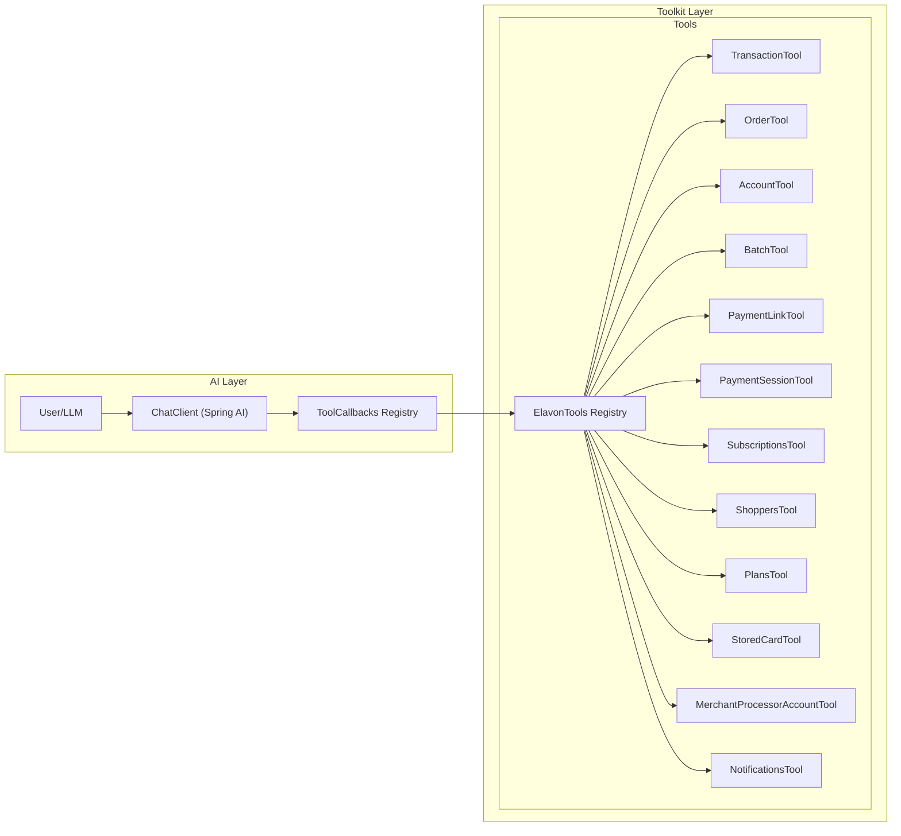
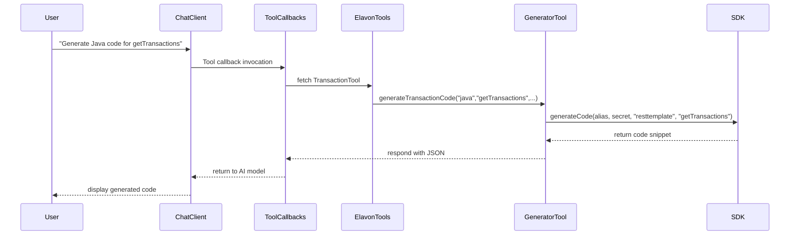

# Elavon Agent Toolkit

## Introduction and Purpose
The **Elavon Agent Toolkit** is a Spring Boot application that provides AI-assisted code generation and mock business operations for Elavon's payment processing APIs.  
It leverages Spring AI (v1.0.0) to define each operation as a tool with clear metadata, enabling conversational models to invoke them seamlessly.  

This document explains the overall design, individual components, and end-to-end process flows in a structured way, so that stakeholders and product owners can understand how the system works.

---

## 1. Application Architecture

### 1.1 High-Level Overview

- **ChatClient**: Entry point for AI interactions.  
- **ToolCallbacks**: Adapts each tool class into a callback the AI can call.  
- **ElavonTools**: Central registry that holds references to all specialized tools.  
- **Tool Classes**: Provide specific functionality (code generation or mock operations).

---

## 2. Key Components and Responsibilities

### 2.1 ChatClient & ToolCallbacks
- **ChatClient**: Manages prompts and AI responses.  
- **ToolCallbacks**: Uses `ToolCallbacks.from(...)` to register each tool class so the AI can invoke methods directly.  

### 2.2 ElavonTools Registry
- **Purpose**: Constructor-injected with each tool.  
- **Exposed Methods**: Accessors like `getTransactionTool()` return the appropriate tool instance.  
- **SDK Info**: `getSdkVersion()` and `getLanguageSdkInfo(lang)` provide versioning and language capabilities to the AI.

### 2.3 Individual Tool Classes
Each tool is a `@Component` with `@Tool` and `@ToolParam` annotations:
- **Code Generators** (Transaction, Order, Account, Batch, PaymentLink):  
  - `generateXYZCode(language, operation, style, alias, secret)`  
  - Delegates to SDK-specific generators (Java, Python, C#, etc.).  
- **Mock Business Tools** (Account, PaymentSession, Subscriptions, Shoppers, Plans, StoredCard, MerchantProcessorAccount, Notifications):  
  - CRUD-like methods returning JSON-mocked responses.  
  - Useful for demonstration and initial integration tests without real API calls.

---

## 3. Process Flows

### 3.1 Code Generation Flow


### 3.2 Account Management Flow (Mock)
1. AI triggers `createAccount(merchantId, type, currency, ...)`.  
2. `AccountTool.createAccount(...)` constructs a JSON response with `accountId`.  
3. AI receives `{status:success,message:...,accountId:...}`.

Repeat for `getAccountById`, `updateAccount`, `deleteAccount`, `getAccountBalance`.

---

## 4. Security & Compliance
- **U.S. Banking Protocols**: Designed per FFIEC & PCI DSS guidelines.  
- **Secure Transport**: Enforce TLS 1.2+ for all communications.  
- **Credential Management**: Alias/secret must be stored in a secure vault (HashiCorp Vault, AWS Secrets Manager).  
- **Logging & Monitoring**: Sensitive data redaction and audit logs required.

---

## 5. Getting Started

### Prerequisites
- Java 17+  
- Maven 3.6+  

### Build & Run
```bash
mvn clean install
mvn spring-boot:run
```
- Application listens on port `8080` by default.

---

## 6. Testing & Extensibility
- **Unit Tests**: Add tests under `src/test/java`.  
- **Add New Tool**:  
  1. Create a new `@Component` with `@Tool` methods.  
  2. Inject into `ElavonTools` constructor.  
  3. Update `ToolConfig` if using explicit callbacks.  

---

## 7. Version & Licensing
- **Version**: 1.0.0  
- **License**: Proprietary and confidential.

*Documentation generated for product owner clarity.*

## Data Flow: Copilot to SDK and Back

Below is a data flow diagram showing how information travels from VS Code Copilot Chat through the multi-call orchestrator (MCP) to the Elavon Agent Toolkit SDK and back to the user.

```mermaid
graph LR
    subgraph "VS Code Copilot Chat"
      A[User Prompt] --> B[OpenAI LLM]
    end
    B --> C[Function Call: MCP Wrapper]
    C --> D[Multi-call Orchestrator (MCP)]
    D --> E[Elavon Agent Toolkit SDK]
    E --> F[Mock Business & Payment Tools]
    F --> G[Response Payload]
    G --> D
    D --> H[Aggregated Function Responses]
    H --> B[LLM Receives Responses]
    B --> I[Model-Generated Response]
    I --> J[Copilot Chat UI]
```
+ **Explanation of Data Flow**
+
+ 1. **User Prompt → LLM**: The user enters a question in VS Code Copilot Chat. The extension packages your prompt, conversation history, and the available tool definitions, then sends it to OpenAI’s API.
+ 2. **LLM → Function Call**: The language model determines if it needs additional context or code-level information. If so, it emits a JSON function call invoking the MCP wrapper with specific sub-calls.
+ 3. **MCP Orchestrator → SDK**: The multi-call orchestrator executes all requested operations (e.g., file reads, code searches) in parallel, directing them into the Elavon Agent Toolkit SDK.
+ 4. **SDK → Tools**: Inside the SDK, the relevant tool classes (TransactionTool, OrderTool, etc.) handle the mock business or payment logic and produce a structured response payload.
+ 5. **Tools → MCP → LLM**: The SDK returns its individual responses back to the orchestrator. The MCP aggregates these function results and forwards them to the LLM as function responses.
+ 6. **LLM → Chat UI**: Finally, the LLM processes both your original prompt and the aggregated function data to craft a single, coherent reply, which is rendered in the Copilot Chat UI for the user.
