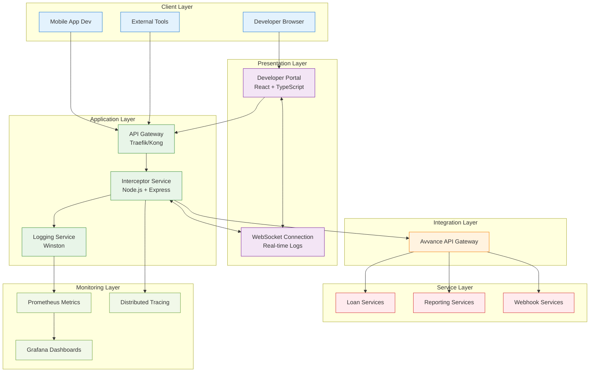
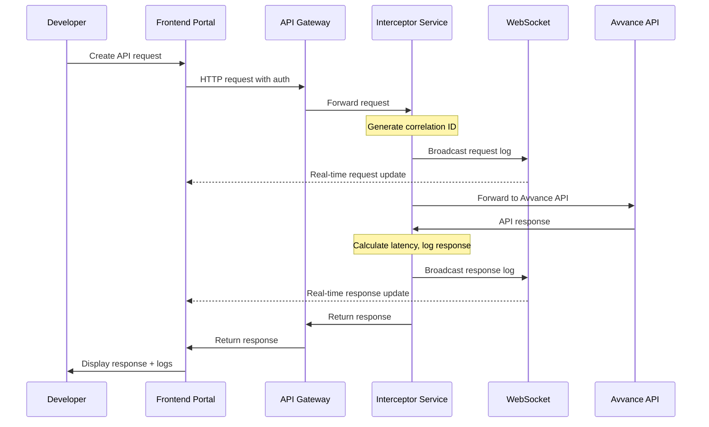
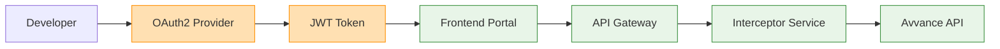
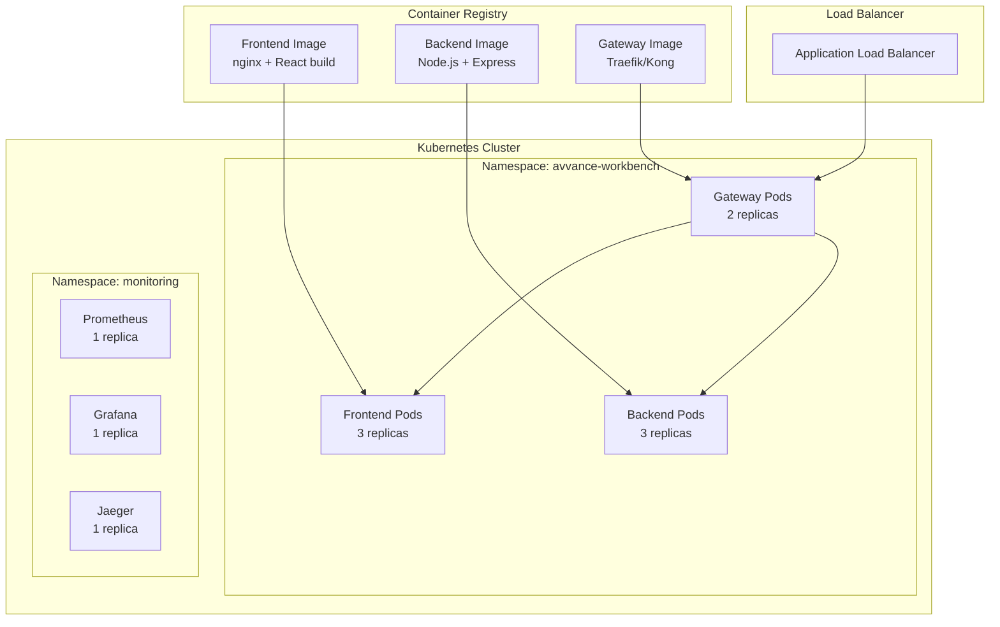

# Avvance Developer Workbench - High Level Design (HLD)

## 1. Executive Summary

The Avvance Developer Workbench is a web-based developer portal that provides real-time API testing, monitoring, and debugging capabilities. Modeled after Stripe's developer experience, it enables developers to interact with Avvance APIs while capturing comprehensive request/response logs through an interceptor service.

**Key Features:**
- Real-time API request/response interception
- Live WebSocket-based log streaming
- Stripe-inspired developer interface
- Zero persistent storage architecture
- 100% open-source technology stack

## 2. System Overview



## 3. Architecture Principles

### 3.1 Design Principles
- **Simplicity First**: Minimal components, maximum functionality
- **Real-time Everything**: Live updates without page refreshes
- **Zero Storage**: No databases, all data flows in real-time
- **Open Source**: 100% open-source technology stack
- **Developer Experience**: Stripe-quality interface and workflows

### 3.2 Non-Functional Requirements
- **Performance**: Sub-100ms request interception overhead
- **Scalability**: Support 1000+ concurrent developer sessions
- **Availability**: 99.9% uptime SLA
- **Security**: OAuth2 authentication, request correlation tracking
- **Maintainability**: Clean separation of concerns, comprehensive logging

## 4. System Components

### 4.1 Frontend Components

| Component | Technology | Responsibility |
|-----------|------------|----------------|
| **Navigation Sidebar** | React + TypeScript | API endpoint browsing, OpenAPI spec parsing |
| **Request Builder** | Monaco Editor | JSON request editing, URL building, header management |
| **Response Viewer** | React + JSON formatting | Response display, status code visualization |
| **Live Console** | Socket.io Client | Real-time log streaming, filtering, search |
| **Error Panel** | React | Error aggregation, retry mechanisms |
| **State Management** | React Query + Context | API state, authentication, UI preferences |

### 4.2 Backend Components

| Component | Technology | Responsibility |
|-----------|------------|----------------|
| **API Gateway** | Traefik/Kong | Load balancing, SSL termination, routing |
| **Interceptor Service** | Node.js + Express | Request/response capture, correlation tracking |
| **WebSocket Server** | Socket.io | Real-time log broadcasting |
| **Logger Service** | Winston | Structured logging, PII masking |
| **Auth Service** | Passport.js | OAuth2 flow, JWT validation |

### 4.3 Infrastructure Components

| Component | Technology | Responsibility |
|-----------|------------|----------------|
| **Container Runtime** | Docker | Application packaging, isolation |
| **Orchestration** | Kubernetes | Container scheduling, scaling, health checks |
| **Service Mesh** | Istio (optional) | Traffic management, security, observability |
| **CI/CD Pipeline** | GitHub Actions | Automated testing, building, deployment |

## 5. Data Flow Architecture

### 5.1 Request Flow


### 5.2 Data Models

#### Request Log Model
```typescript
interface RequestLog {
  id: string;                    // Correlation ID
  timestamp: string;             // ISO timestamp
  type: 'request';
  method: string;                // HTTP method
  url: string;                   // Request URL
  headers: Record<string, string>;
  body?: any;                    // Request payload
  query?: Record<string, string>;
  partnerId: string;             // Partner identification
  userId: string;                // Developer identification
}
```

#### Response Log Model
```typescript
interface ResponseLog {
  id: string;                    // Same correlation ID
  timestamp: string;             // ISO timestamp
  type: 'response';
  method: string;                // HTTP method
  url: string;                   // Request URL
  status: number;                // HTTP status code
  duration: number;              // Request duration in ms
  headers: Record<string, string>;
  body?: any;                    // Response payload
  error?: string;                // Error message if failed
}
```

## 6. Security Architecture

### 6.1 Authentication & Authorization


### 6.2 Security Controls

| Layer | Security Control | Implementation |
|-------|------------------|----------------|
| **Transport** | TLS 1.3 | All HTTP communications encrypted |
| **Authentication** | OAuth2 + JWT | Token-based authentication with expiry |
| **Authorization** | RBAC | Role-based access control (developer, admin) |
| **API Security** | Rate Limiting | Configurable rate limits per partner |
| **Data Protection** | PII Masking | Automatic detection and redaction |
| **Audit** | Request Tracking | Correlation IDs for complete audit trail |

## 7. Deployment Architecture

### 7.1 Containerization Strategy


### 7.2 Environment Configuration

| Environment | Purpose | Configuration |
|-------------|---------|---------------|
| **Development** | Local development | Docker Compose, hot reload |
| **Staging** | Integration testing | Kubernetes, reduced resources |
| **Production** | Live system | Kubernetes, HA configuration |

## 8. Monitoring & Observability

### 8.1 Metrics Collection
- **Application Metrics**: Request count, latency, error rates
- **System Metrics**: CPU, memory, network utilization
- **Business Metrics**: API usage per partner, endpoint popularity

### 8.2 Logging Strategy
- **Structured Logging**: JSON format with correlation IDs
- **Log Levels**: DEBUG, INFO, WARN, ERROR
- **Real-time Streaming**: WebSocket-based log delivery
- **PII Protection**: Automatic masking of sensitive data

### 8.3 Alerting
- **Performance Alerts**: P95 latency > 500ms
- **Error Rate Alerts**: Error rate > 5%
- **Availability Alerts**: Service downtime detection

## 9. Scalability & Performance

### 9.1 Horizontal Scaling
- **Frontend**: Stateless React application, scales linearly
- **Backend**: Stateless Node.js service, auto-scaling based on CPU
- **Gateway**: Load balancer distribution across multiple instances

### 9.2 Performance Optimization
- **Caching**: Browser caching for static assets
- **Compression**: Gzip compression for API responses
- **WebSocket**: Efficient real-time communication
- **Resource Limits**: Kubernetes resource constraints

## 10. Disaster Recovery

### 10.1 Backup Strategy
- **Configuration**: GitOps approach, all configs in version control
- **No Data Loss**: Zero persistent storage eliminates backup concerns
- **Infrastructure as Code**: Kubernetes manifests, Helm charts

### 10.2 Recovery Procedures
- **Service Recovery**: Kubernetes self-healing, pod restart
- **Complete Failure**: Redeploy from Git repository
- **RTO**: 15 minutes for complete system recovery
- **RPO**: 0 seconds (no persistent data)

## 11. Capacity Planning

### 11.1 Resource Requirements

| Component | CPU | Memory | Storage | Network |
|-----------|-----|--------|---------|---------|
| **Frontend Pod** | 100m | 128Mi | 1Gi | 10Mbps |
| **Backend Pod** | 200m | 256Mi | 1Gi | 50Mbps |
| **Gateway Pod** | 100m | 128Mi | 1Gi | 100Mbps |

### 11.2 Scaling Targets
- **Users**: 1000 concurrent developers
- **Requests**: 10,000 API calls per minute
- **WebSocket Connections**: 1000 simultaneous connections

## 12. Implementation Roadmap

### Phase 1: Core Functionality (4 weeks)
- Basic React frontend with request builder
- Node.js interceptor service
- WebSocket real-time logging
- Docker containerization

### Phase 2: Production Readiness (3 weeks)
- Kubernetes deployment
- OAuth2 authentication
- Monitoring and alerting
- CI/CD pipeline

### Phase 3: Enhanced Features (2 weeks)
- Advanced filtering and search
- Error analytics
- Performance optimization
- Documentation

## 13. Risk Assessment

| Risk | Probability | Impact | Mitigation |
|------|-------------|--------|------------|
| **WebSocket Connection Loss** | Medium | Medium | Auto-reconnection, connection health checks |
| **High Request Volume** | Medium | High | Rate limiting, auto-scaling |
| **Security Breach** | Low | High | OAuth2, TLS, regular security audits |
| **Service Dependencies** | Medium | Medium | Circuit breakers, fallback mechanisms |

## 14. Success Metrics

- **Developer Adoption**: 80% of partners actively using the portal
- **Performance**: 95% of requests processed under 100ms overhead
- **Reliability**: 99.9% uptime
- **User Satisfaction**: 4.5/5 developer experience rating
